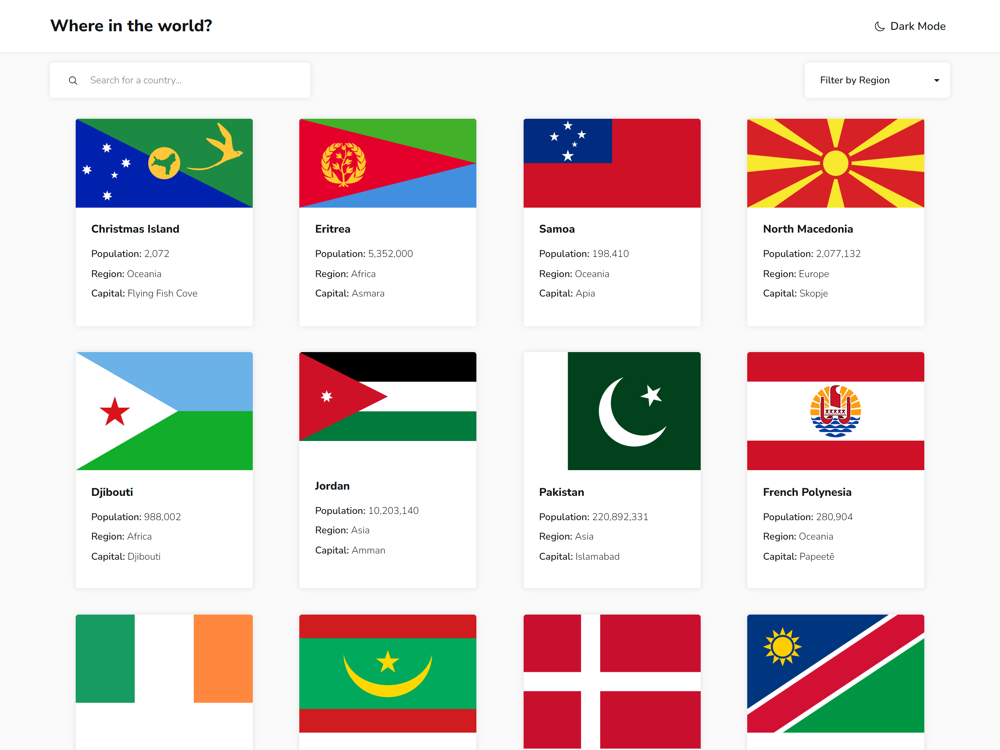

# Countries at a Glance

This is a solution to the [REST Countries API with color theme switcher challenge on Frontend Mentor](https://www.frontendmentor.io/challenges/rest-countries-api-with-color-theme-switcher-5cacc469fec04111f7b848ca). The website is built from the provided design using React.

## Table of contents

- [Overview](#overview)
  - [The challenge](#the-challenge)
  - [Screenshot](#screenshot)
  - [Links](#links)
- [My process](#my-process)
  - [Built with](#built-with)
  - [What I learned](#what-i-learned)
  - [Continued development](#continued-development)
  - [Useful resources](#useful-resources)

## Overview

### The challenge

Users should be able to:

- See all countries from the API on the homepage
- Search for a country using an `input` field
- Filter countries by region
- Click on a country to see more detailed information on a separate page
- Click through to the border countries on the detail page
- Toggle the color scheme between light and dark mode

### Screenshot



### Links

- Live Site URL: [https://tascate.github.io/countries-at-a-glance/](https://tascate.github.io/countries-at-a-glance/)

## My process

### Built with

- [React](https://reactjs.org/) - JS library
- [Bootstrap](https://react-bootstrap.netlify.app/) - For dropdown
- Semantic HTML5 markup
- CSS custom properties
- Flexbox
- CSS Grid
- Responsive Design

### What I learned

During this project, I extensively used React for the first time in awhile. I especially used this for toggling between the Country Card page and the Country Detail page when a Country is selected.

To go along with this, I minimized the usage of media queries and made the decision to leave the scaling to be done by the browser mostly. Because of this, the website is not only responsive but can grow to any screen size with minimal media query tweaks.

I also learned how fetching and Promises when handling API Requests for data. This was for interacting with the Rest Countries API To receive various country data.

The country card gallery will fill up available columns if there is space:

```css
.Country-list {
  display: grid;
  grid-template-columns: repeat(auto-fill, 255px);
}
```

### Continued development

For future projects, I want to try to stray away from inputting strict values when changing from a mobile to desktop design using media queries. Instead, I want to employ the use of scaling features such as CSS Grid and Flexwrap to simplify CSS code and allow the website to be responsive to many screen sizes.

I also will continue to learn about the intricacies of React to better employ its usage and simplify my code.

### Useful resources

- [Dark Mode with CSS Variables](https://pedromarquez.dev/blog/2022/7/dark-mode-css) - This helped me easily set up Dark Mode colors using CSS variables
- [React Dev Learn](https://react.dev/learn) - A great resource for getting started with React
